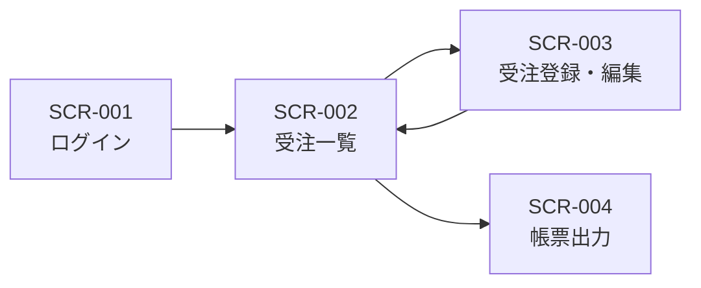

> ステータス: **draft**

## デザイン方針

{/* TODO: 対象ユーザーと利用シーンから方針を記載 */}

- 例: 主要ユーザーは PC 操作に不慣れな 50 代の事務担当者のため、1 画面 1 タスクのシンプルな構成とする
- 例: 社内システムのため装飾は最小限とし、入力効率を優先する

### 対応デバイス・ブラウザ

{/* TODO: NFR に対応させて記載 */}

| 項目 | 対応範囲 | 根拠要件 |
| --- | --- | --- |
| デバイス | 例: PC(1280px〜)、タブレット | FR-xxx |
| ブラウザ | 例: Chrome / Edge 最新版 | — |

## 画面一覧

{/* TODO: IDは SCR-001 から連番で採番。対応する機能要件を必ず紐付ける */}

| ID | 画面名 | 概要 | 対応要件 |
| --- | --- | --- | --- |
| SCR-001 | 例: ログイン | ID/パスワードによる認証 | NFR-003 |
| SCR-002 | 例: 受注一覧 | 受注の検索・一覧表示 | FR-002 |
| SCR-003 | 例: 受注登録・編集 | 受注情報の入力フォーム | FR-001 |
| SCR-004 | 例: 帳票出力 | 月次帳票の条件指定と PDF 出力 | FR-003 |

## 画面遷移図

{/* TODO: 画面一覧に合わせて更新 */}

## 画面詳細

{/* TODO: 主要画面ごとにワイヤーフレーム・項目定義を記載。Figma等の外部リンクでも可 */}

### SCR-002: 受注一覧

- ワイヤーフレーム: {/* TODO: Figma URL または画像 */}
- 表示項目: 受注番号、顧客名、受注日、金額、ステータス
- 操作: 検索、新規登録ボタン、行クリックで編集画面へ

## 共通UIルール

{/* TODO: プロジェクトで統一するルールを記載 */}

- 例: 必須項目はラベル右に赤い「必須」バッジを表示
- 例: 破壊的操作(削除)は確認ダイアログを挟む
- 例: 日付表示は `YYYY/MM/DD` 形式で統一
