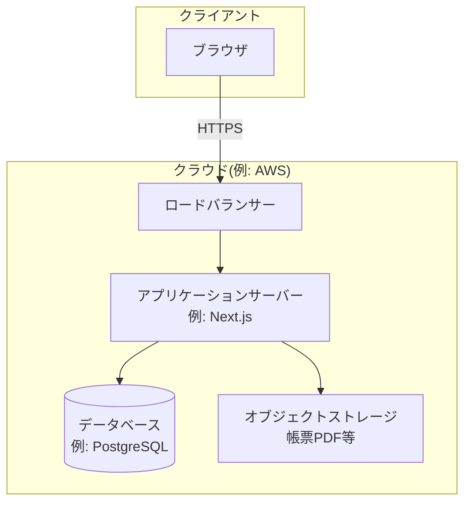

> ステータス: **draft**

## システム構成図

{/* TODO: 技術選定の結果に合わせて更新 */}

## コンポーネント設計

{/* TODO: 主要コンポーネントの責務を記載 */}

| コンポーネント | 責務 | 対応要件 |
| --- | --- | --- |
| 例: 認証モジュール | ログイン・セッション管理 | NFR-003 |
| 例: 受注管理モジュール | 受注 CRUD・検索 | FR-001, FR-002 |
| 例: 帳票モジュール | PDF 生成・ダウンロード | FR-003 |

## データモデル

詳細は [ER図](/design/er-diagram) を参照。

## インフラ・環境構成

{/* TODO: 環境ごとの構成を記載。運用費用見積もりの根拠になる */}

| 環境 | 用途 | 構成 |
| --- | --- | --- |
| 本番 | 顧客利用 | 例: EC2 t3.small ×1、RDS db.t3.micro |
| ステージング | 受け入れ確認 | 例: 本番の縮小構成 |
| 開発 | 開発・テスト | 例: ローカル + Docker |

## セキュリティ設計

実現方式の詳細は [非機能設計](/design/nfr-spec) を参照。ここではインフラ・アーキテクチャ観点の要点のみ記載する。

{/* TODO: NFR のセキュリティ要件に対応させて記載 */}

- 例: 全通信を TLS 1.2 以上で暗号化(NFR-003)
- 例: パスワードは bcrypt でハッシュ化(NFR-003)
- 例: 権限は管理者/一般の 2 ロール

## 運用設計

実現方式の詳細は [非機能設計](/design/nfr-spec) を参照。ここではインフラ・アーキテクチャ観点の要点のみ記載する。

{/* TODO: バックアップ・監視・障害対応の方針を記載。運用費用見積もりの根拠になる */}

| 項目 | 方針 | 対応要件 |
| --- | --- | --- |
| バックアップ | 例: RDS 自動スナップショット(日次・30日保持) | NFR-004 |
| 監視 | 例: 死活監視 + エラー通知(メール) | NFR-002 |
| 障害対応 | 例: 平日 9-18 時、一次回答 4 時間以内 | NFR-002 |
