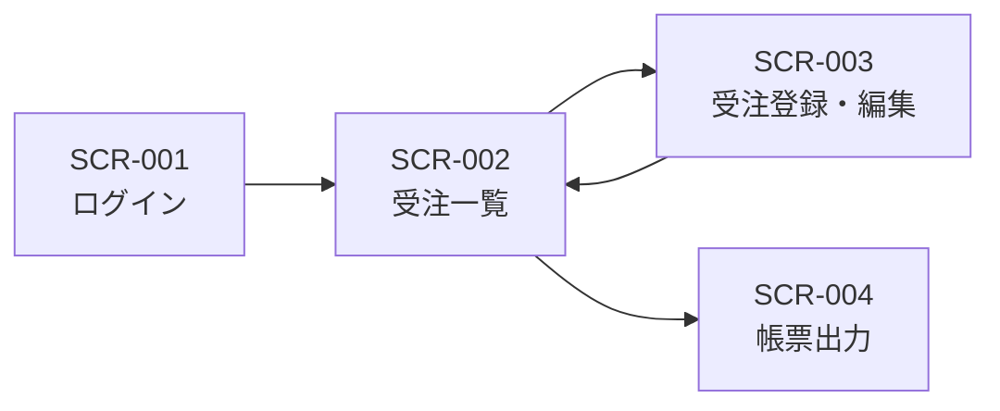

> ステータス: **draft**

[UI/UX設計](/design/ui-ux)の画面一覧(SCR-xxx)を前提に、画面間の遷移を図示します。

## 画面遷移図

{/* TODO: 画面一覧に合わせて更新 */}

## 遷移条件

{/* TODO: 遷移のトリガー・条件を記載 */}

| 遷移元 | 遷移先 | トリガー・条件 | 備考 |
| --- | --- | --- | --- |
| SCR-001 | SCR-002 | 例: ログイン成功 | — |
| SCR-002 | SCR-003 | 例: 「新規登録」ボタン押下、または一覧行クリック | — |
| SCR-003 | SCR-002 | 例: 保存成功、またはキャンセル | — |
| SCR-002 | SCR-004 | 例: 「帳票出力」ボタン押下 | — |

## 例外時の遷移

{/* TODO: エラー・権限切れ等の遷移を記載 */}

- 例: セッション切れを検知した場合は SCR-001 へ強制遷移する
- 例: 権限のない画面へ直接アクセスした場合はエラー画面を表示する
