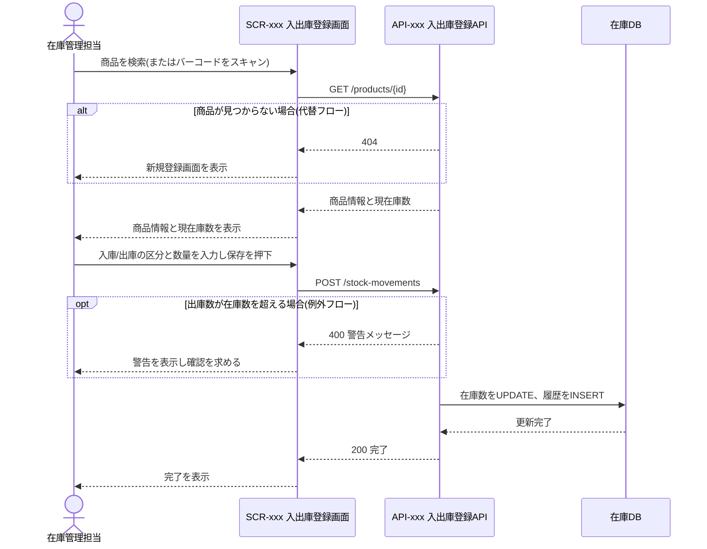

> ステータス: **draft**

[ユースケース](/requirements/use-case)の主要フロー(UC-xxx)について、画面・API・データベース間のやり取りを詳細化します。専用IDは採番せず、UC-xxxに対応付けます。複数UCにまたがる横断フローは見出しに対象UCを併記します(例: `### 主要フロー: 入出庫記録〜在庫確認(UC-001, UC-002)`)。

## 対象フロー一覧

{/* TODO: 設計判断が必要な主要フローのみ記載。UC-xxxは12-use-case.mdxの定義と一致させる */}

| 対応UC | フロー名 | 概要 | 関連画面 | 関連API |
| --- | --- | --- | --- | --- |
| UC-001 | 例: 入出庫を記録する | 商品の入庫・出庫数を登録し在庫数を更新する | SCR-xxx | API-xxx |

## フロー詳細

{/* TODO: 12-use-case.mdxのユースケース記述を前提に、画面・API・DBまで具体化する */}

### UC-001: 例: 入出庫を記録する

