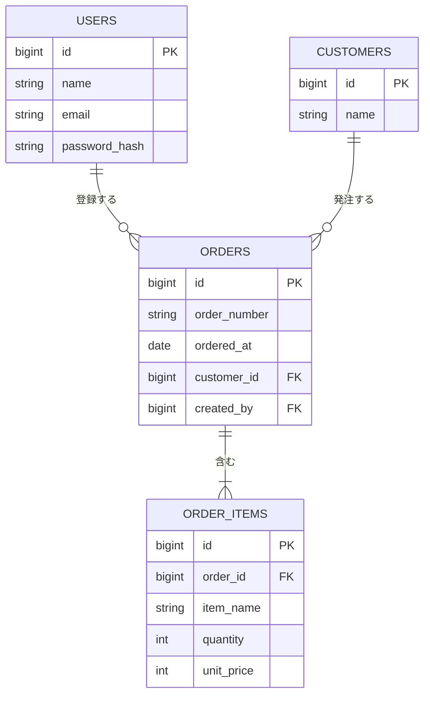

> ステータス: **draft**

[アーキテクチャ設計](/design/architecture)のコンポーネント設計を前提に、データモデルを図示します。詳細なカラム定義・制約は実装フェーズで別途作成します。

## ER図

{/* TODO: 主要エンティティのER図を記載。詳細なテーブル定義は実装フェーズで別途作成 */}

## エンティティ一覧

{/* TODO: 対応する機能要件を必ず紐付ける */}

| エンティティ | 概要 | 主なリレーション | 対応要件 |
| --- | --- | --- | --- |
| USERS | システム利用者 | ORDERS を作成する | NFR-003 |
| CUSTOMERS | 発注元の顧客 | ORDERS を発注する | FR-001 |
| ORDERS | 受注 | ORDER_ITEMS を含む | FR-001, FR-002 |
| ORDER_ITEMS | 受注明細 | ORDERS に属する | FR-001 |

## 備考

{/* TODO: 命名規約・共通カラムのルールを記載 */}

- 例: 論理削除は `deleted_at` カラムで管理する
- 例: 全テーブルに `created_at` / `updated_at` を付与する
