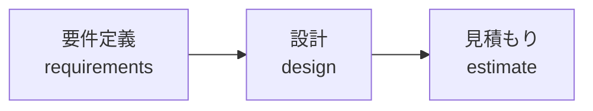

このサイトは、プロジェクトの **要件定義 → 設計 → 見積もり** を一元管理するドキュメントです。

:::note
テンプレートから作成されたドキュメントです。`<!-- TODO: ... -->` コメントが残っている箇所は未記入です。
:::

## ドキュメント構成

| セクション | 内容 | 主な読者 |
| --- | --- | --- |
| [要件定義](/requirements) | プロジェクト概要・要求定義・要件定義 | 顧客・PM・開発チーム |
| [設計](/design) | UI/UX・技術選定・アーキテクチャ | 開発チーム・PM |
| [見積もり](/estimate) | 開発費用・運用費用 | 顧客・営業・PM |

## 作成フロー

ドキュメントは上流から下流へ、次の順序で作成します。

上流のドキュメントを変更した場合は、必ず下流のドキュメントへの影響を確認してください。

## ドキュメントステータス

各ページの冒頭にあるステータス行(`> ステータス: **draft**`)で進捗を管理します。

- `draft` — 作成中
- `review` — レビュー依頼中
- `approved` — 顧客・関係者承認済み
