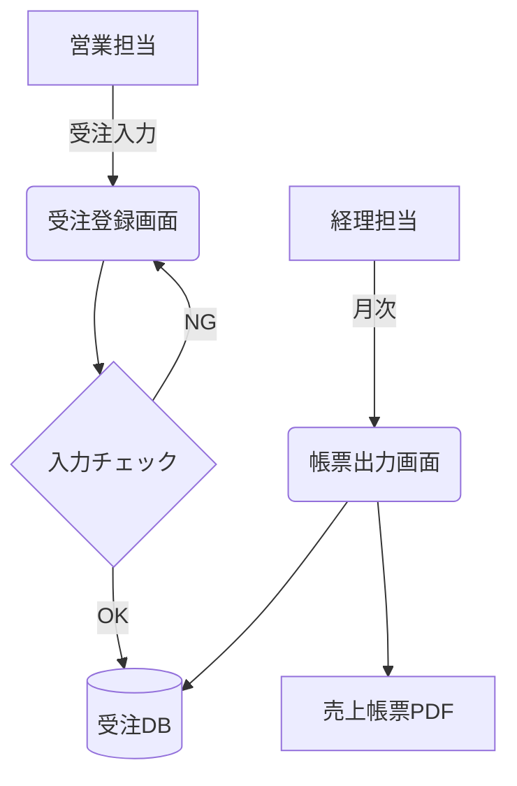

> ステータス: **draft**

[要求定義](/requirements/user-requirements)の各要求をシステム要件へ落とし込みます。各要件には対応する要求 ID を必ず記載します。

## 機能要件

<!-- TODO: IDは FR-001 から連番で採番。対応要求のない機能要件は原則作らない -->

| ID | 機能要件 | 対応要求 | 優先度 |
| --- | --- | --- | --- |
| FR-001 | 例: 受注の登録・編集・削除ができる | REQ-001 | Must |
| FR-002 | 例: 受注を顧客名・受注番号・期間で検索できる | REQ-001 | Must |
| FR-003 | 例: 月次売上帳票を PDF 形式で出力できる | REQ-002 | Must |

### 機能詳細

<!-- TODO: 複雑な機能は個別に詳細を記載 -->

#### FR-002: 受注検索

- 検索条件: 顧客名(部分一致)、受注番号(完全一致)、受注日(期間指定)
- 検索結果はページネーション表示(1 ページ 50 件)

## 非機能要件

<!-- TODO: IDは NFR-001 から連番で採番。カテゴリはIPA非機能要求グレードを参考に -->

| ID | カテゴリ | 非機能要件 | 対応要求 |
| --- | --- | --- | --- |
| NFR-001 | 性能 | 例: 通常操作の画面応答は 3 秒以内 | REQ-001 |
| NFR-002 | 可用性 | 例: 営業時間帯(平日 9-18 時)の稼働率 99.5% 以上 | — |
| NFR-003 | セキュリティ | 例: 通信は TLS 1.2 以上で暗号化。パスワードはハッシュ化保存 | — |
| NFR-004 | 運用・保守 | 例: 日次で自動バックアップを取得し 30 日分保持 | — |

## ユースケース

<!-- TODO: 主要な業務フローを mermaid で図示 -->

## 用語定義

<!-- TODO: 顧客固有の業務用語を定義 -->

| 用語 | 定義 |
| --- | --- |
| 例: 受注 | 顧客からの正式な注文。見積もり段階のものは含まない |
