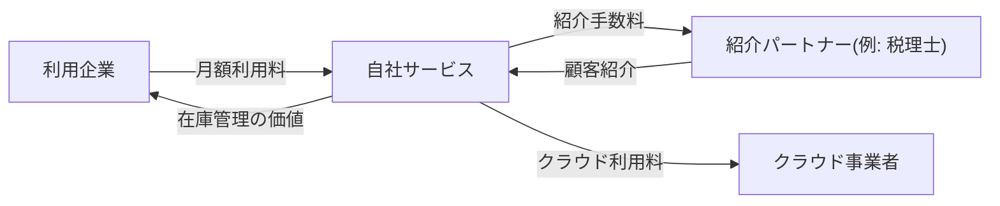

> ステータス: **draft**

事業としての成立条件を整理します。収益モデルは [KPI ツリー](/requirements/kpi-tree)と[見積もり](/estimate)の前提になります。

## ビジネスモデルキャンバス

{/* TODO: 9 ブロックを埋める。未確定のブロックは仮説と明記 */}

| ブロック | 内容 |
| --- | --- |
| 顧客セグメント | 例: 従業員 300 名以下の製造業・卸売業 |
| 価値提案 | 例: 専任担当者なしで在庫差異をなくせる |
| チャネル | 例: Web 広告、税理士・商工会経由の紹介 |
| 顧客との関係 | 例: セルフサーブ + 導入時のみオンライン支援 |
| 収益の流れ | 例: 月額サブスクリプション |
| 主要リソース | 例: 開発チーム、カスタマーサクセス |
| 主要活動 | 例: プロダクト開発、導入支援 |
| 主要パートナー | 例: バーコードリーダー販売代理店 |
| コスト構造 | 例: 人件費、クラウド利用料、広告費 |

## 収益モデル

{/* TODO: 課金形態と単価の仮説を記載。単価は最終的にユーザーが確定する */}

| 収益源 | 課金形態 | 単価 | 想定数量 | 備考 |
| --- | --- | --- | --- | --- |
| 例: 基本プラン | 月額サブスクリプション | 例: ¥9,800/月(税抜) | 例: 100 社(1 年目) | {/* TODO */} |
| 例: 導入支援 | 一時金 | 例: ¥50,000(税抜) | 例: 30 社/年 | 希望者のみ |

## 価値とお金の流れ

{/* TODO: 登場人物間の価値・金銭の流れを図示 */}

## 成立条件とリスク

{/* TODO: このモデルが成立するための前提と、崩れる条件を明記 */}

- 例: 成立条件: 解約率が月 2% 以下に収まること
- 例: リスク: 紹介チャネルが機能しない場合、広告費が想定を超過する

## 下流ドキュメントへの反映

- 収益・コストの前提 → [KPI ツリー](/requirements/kpi-tree)の KGI/KPI に反映
- 運用コストの前提 → [運用費用](/estimate/operation-cost)に反映
