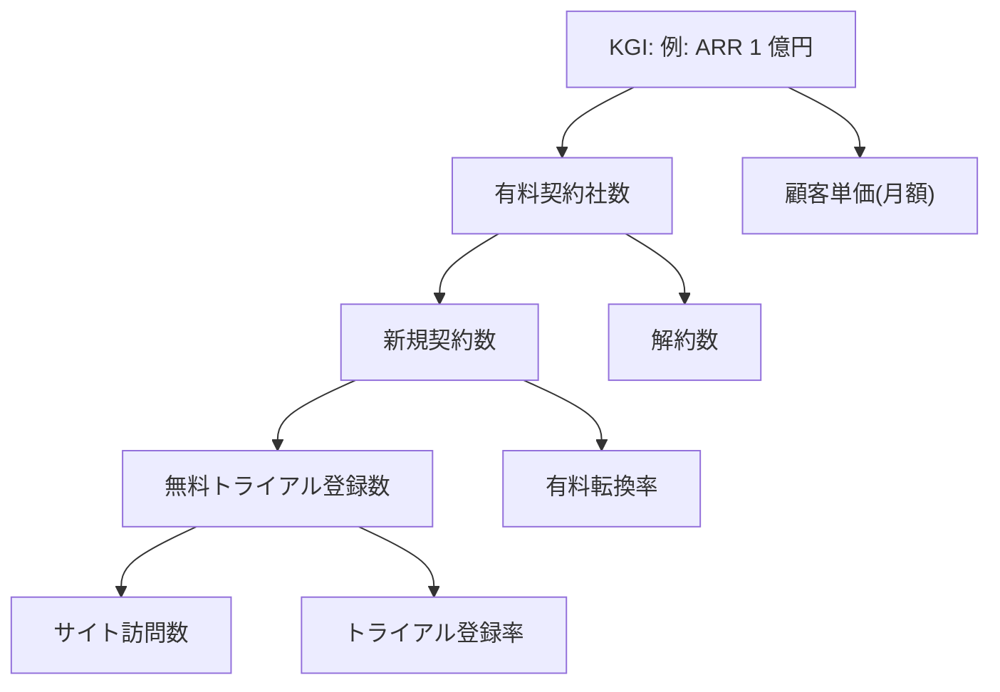

> ステータス: **draft**

事業目標(KGI)を計測可能な指標(KPI)へ分解します。KPI の計測に必要な機能・データは[システム要件定義](/requirements/system-requirements)の FR/NFR へ反映します。

## KGI

{/* TODO: 事業の最終目標を期限付き・定量で 1 つ定める */}

例: 2027 年度末に ARR(年間経常収益)1 億円を達成する。

## KPI ツリー

{/* TODO: KGI を掛け算・足し算で分解する。分解の式が成り立つことを確認 */}

## KPI 一覧

{/* TODO: ID は KPI-001 から連番で採番。ツリーの各ノードと対応させる */}

| ID | 指標 | 定義・算出式 | 現状値 | 目標値 | 計測方法 |
| --- | --- | --- | --- | --- | --- |
| KPI-001 | 例: 有料契約社数 | 例: 月末時点の有料プラン契約数 | 例: — | 例: 100 社(1 年目末) | 例: 契約管理データ |
| KPI-002 | 例: 有料転換率 | 例: 有料転換数 ÷ トライアル登録数 | 例: — | 例: 20% | 例: プロダクト内計測 |
| KPI-003 | 例: 月次解約率 | 例: 当月解約数 ÷ 前月末契約数 | 例: — | 例: 2% 以下 | 例: 契約管理データ |

## 計測要件への反映

{/* TODO: KPI 計測のためにシステムに必要な機能・データを要件へ反映する */}

| KPI | 必要な機能・データ | 反映先 |
| --- | --- | --- |
| 例: KPI-002 | 例: トライアル登録・転換イベントの記録 | FR-xxx |

## レビューサイクル

{/* TODO: 誰が・どの頻度で KPI を確認し、目標を見直すかを決める */}

- 例: 月次で経営会議にてレビュー。四半期ごとに目標値を見直す
