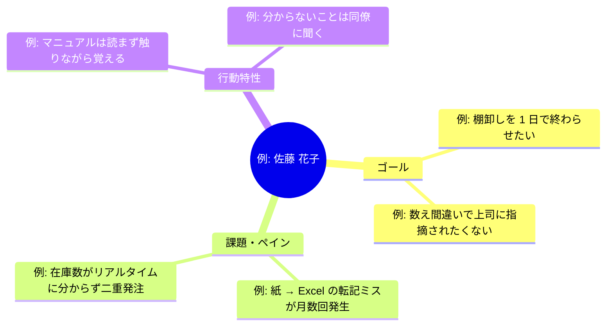

> ステータス: **draft**

プロダクトの主要ユーザー像を定義します。ペルソナは[カスタマージャーニーマップ](/requirements/customer-journey-map)・[ユーザーストーリーマッピング](/requirements/user-story-mapping)・[UI/UX 設計](/design/ui-ux)の入力になります。推測で作らず、[ユーザーヒアリング](/requirements/user-interview)や調査を根拠にします。

## ペルソナ一覧

{/* TODO: ID は PS-001 から連番で採番。主要な 1〜3 人に絞る(多すぎると機能しない) */}

| ID | 名前(仮名) | 属性概要 | 主な利用シーン |
| --- | --- | --- | --- |
| PS-001 | 例: 佐藤 花子 | 例: 32 歳・製造業の在庫管理担当 | 例: 倉庫での入出庫作業・月次棚卸し |
| PS-002 | 例: 田中 一郎 | 例: 55 歳・同社の経営者 | 例: 月次の在庫金額の確認 |

## ペルソナ詳細

### PS-001: 例: 佐藤 花子

{/* TODO: 各ペルソナについて以下を埋める */}

| 項目 | 内容 |
| --- | --- |
| 年齢・職業 | 例: 32 歳・製造業(従業員 50 名)の総務兼在庫管理担当 |
| IT リテラシー | 例: スマートフォンは日常的に使うが、PC は Excel の基本操作まで |
| 利用デバイス | 例: 業務ではスマートフォンと共有 PC 1 台 |
| 利用環境 | 例: 倉庫内(電波が弱い場所あり)。手袋をしたまま操作することがある |

#### ゴール・ペイン・行動特性

{/* TODO: ゴール(達成したいこと)・課題・行動特性をマインドマップで整理 */}

### PS-002: 例: 田中 一郎

{/* TODO: PS-001 と同じ構成で記載 */}

## 作成根拠

{/* TODO: どの調査・ヒアリングに基づくペルソナかを記録 */}

| ペルソナ | 根拠 |
| --- | --- |
| PS-001 | 例: 2026/07/01 ユーザーヒアリング(3 名)、現場見学 |
