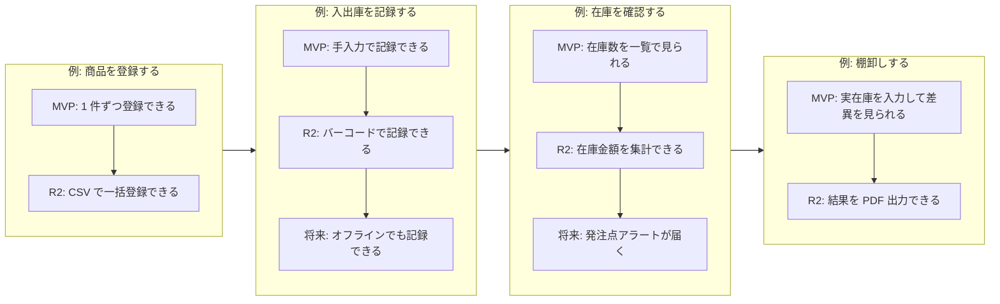

> ステータス: **draft**

ユーザーの活動(バックボーン)を時系列に並べ、その下にユーザーストーリーを配置してリリース単位に分割します。MVP のスコープ決定と[見積もり](/estimate)のフェーズ分けの根拠になります。

## ストーリーマップ

{/* TODO: 横 = ユーザーの活動(バックボーン・時系列)、縦 = リリース(上ほど優先度が高い) */}

## ユーザーストーリー一覧

{/* TODO: 「<ペルソナ> として、<目的> のために、<行動> したい」の形式で記載し、REQ/FR と紐付ける */}

| ストーリー | ペルソナ | リリース | 対応 REQ/FR |
| --- | --- | --- | --- |
| 例: 在庫管理担当として、転記ミスをなくすために、入出庫をその場でスマートフォンから記録したい | PS-001 | MVP | REQ-xxx |
| 例: 経営者として、資金繰りを判断するために、月末の在庫金額を確認したい | PS-002 | リリース 2 | REQ-xxx |

## MVP の判断基準

{/* TODO: 何をもって MVP に含める/外すを判断したかを記録(スコープ交渉の根拠になる) */}

- 例: 含める: ペルソナ PS-001 の日常業務(入出庫〜棚卸し)が一巡できること
- 例: 外す: 集計・分析系はリリース 2 へ(手元の Excel で代替可能なため)

## 下流への反映

- リリース分割 → [開発費用](/estimate/development-cost)の WBS・フェーズ分けに反映
- MVP のストーリー → [システム要件定義](/requirements/system-requirements)の FR に反映
