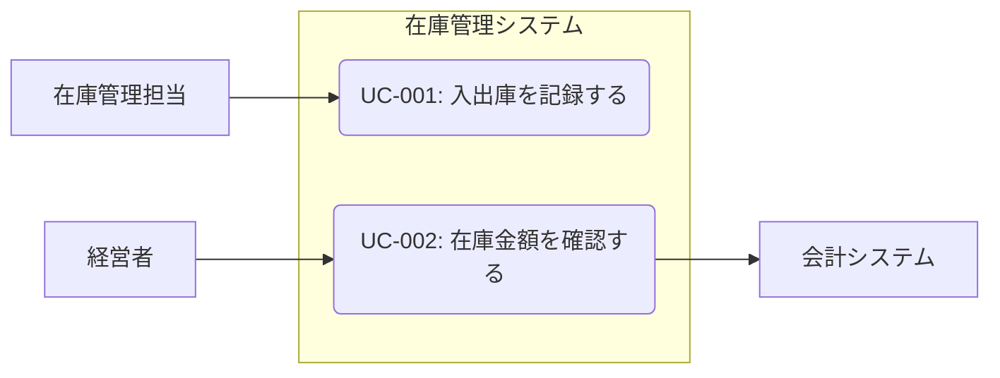
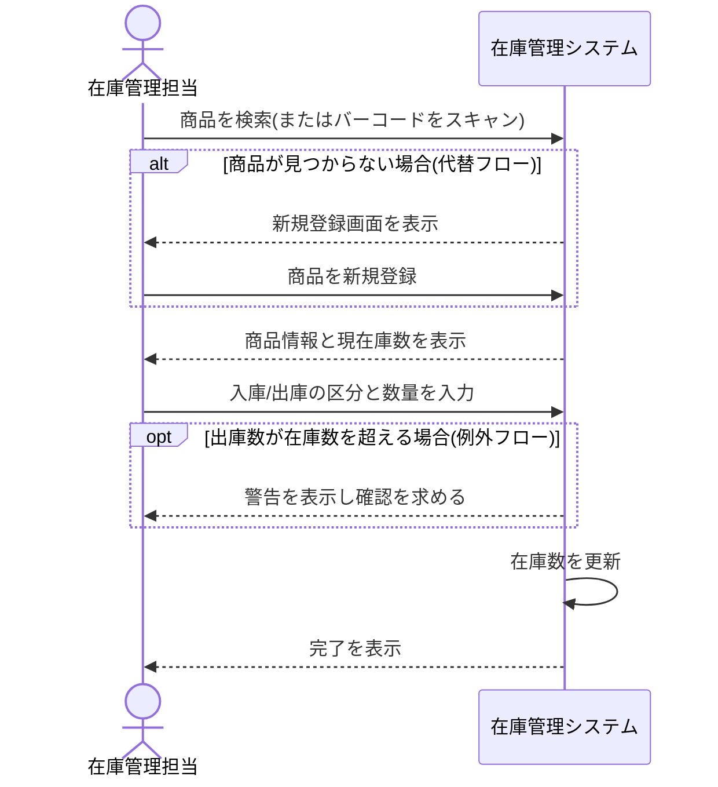

> ステータス: **draft**

システムに対する利用者(アクター)の操作単位を定義します。各ユースケースは[要求定義](/requirements/user-requirements)の REQ に紐付け、[画面一覧](/design/ui-ux)・テスト設計の入力にします。

## アクター一覧

{/* TODO: システムを利用する人・外部システムを列挙 */}

| アクター | 説明 |
| --- | --- |
| 例: 在庫管理担当 | 日々の入出庫・棚卸しを行う現場担当者 |
| 例: 経営者 | 集計結果の閲覧のみ行う |
| 例: 会計システム | 月次で在庫金額データを受け取る外部システム |

## ユースケース一覧

{/* TODO: ID は UC-001 から連番で採番。「アクター + 動詞」で命名する */}

| ID | ユースケース | アクター | 概要 | 対応要求 |
| --- | --- | --- | --- | --- |
| UC-001 | 例: 入出庫を記録する | 在庫管理担当 | 例: 商品の入庫・出庫数を登録する | REQ-xxx |
| UC-002 | 例: 在庫金額を確認する | 経営者 | 例: 月末在庫金額の集計を閲覧する | REQ-xxx |

## ユースケース図

{/* TODO: アクターとユースケースの関係を図示 */}

## ユースケース記述

{/* TODO: 主要な(複雑・重要な)ユースケースのみ詳細を記述する */}

### UC-001: 例: 入出庫を記録する

| 項目 | 内容 |
| --- | --- |
| アクター | 例: 在庫管理担当 |
| 事前条件 | 例: 対象商品がマスタに登録済みであること |
| 事後条件 | 例: 在庫数が更新され、履歴が記録されていること |
| トリガー | 例: 商品の入荷・出荷が発生したとき |

#### フロー

{/* TODO: 基本フローを時系列で描き、代替フローは alt、例外フローは opt で表現する */}

